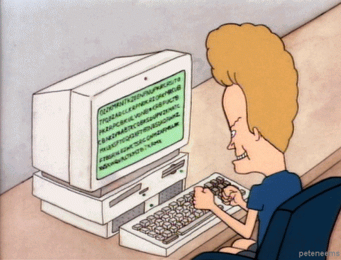

<!--
**chrisyab21/chrisyab21** is a ✨ _special_ ✨ repository because its `README.md` (this file) appears on your GitHub profile.

Here are some ideas to get you started:

- 🔭 I’m currently working on ...
- 🌱 I’m currently learning ...
- 👯 I’m looking to collaborate on ...
- 🤔 I’m looking for help with ...
- 💬 Ask me about ...
- 📫 How to reach me: ...
- 😄 Pronouns: ...
- ⚡ Fun fact: ...
-->

Hi there My name is Christian
=================================================================================================================================

Frontend Developer: React, TypeScript,
--------------------------------------

I'm Christian, a Systems Engineering graduate dedicated to frontend development, specializing in React, TypeScript, and modern tools like Tailwind. My education allows me to design attractive and functional interfaces, with a focus on usability and aesthetics. While my primary focus is on frontend, I have a solid background in backend development with C# and .Net, enhancing my understanding of the entire software development process. I'm proficient with MySqlServer for database management and use Git for version control, ensuring effective team collaborations. Known for being fun and playful, I am always responsible and deeply passionate about programming. I'm ready to tackle new challenges and contribute to innovative projects with a touch of creativity and efficiency. If you appreciate a mix of technical skills, engineering education, and a positive work environment, let's talk!

 
<table>
  <tr>
    <td>🌍 I'm based in Santa Cruz, Bolivia</td>
    <td colspan="4" rowspan="4"></td>
  </tr>
  <tr>
    <td>✉️ You can contact me at christianyabeta@gmail.com</td>
  </tr>
  <tr>
    <td>🧠 I'm learning Next.Js</td>
  </tr>
  <tr>
    <td>
⚡ I must thank my neighbor for his powerful Wifi, but shh don't tell  &ensp;&ensp;&nbsp;&nbsp;&nbsp;&nbsp;&nbsp; him I have it! 😂
</td>
  </tr>
</table>

### Skills

### Socials

 <a href="https://www.github.com/chrisyab21" target="_blank" rel="noreferrer"> <picture> <source media="(prefers-color-scheme: dark)" srcset="https://raw.githubusercontent.com/danielcranney/readme-generator/main/public/icons/socials/github-dark.svg" /> <source media="(prefers-color-scheme: light)" srcset="https://raw.githubusercontent.com/danielcranney/readme-generator/main/public/icons/socials/github.svg" />  </picture> </a> <a href="https://www.linkedin.com/in/christian-yabeta-690390265" target="_blank" rel="noreferrer"> <picture> <source media="(prefers-color-scheme: dark)" srcset="https://raw.githubusercontent.com/danielcranney/readme-generator/main/public/icons/socials/linkedin-dark.svg" /> <source media="(prefers-color-scheme: light)" srcset="https://raw.githubusercontent.com/danielcranney/readme-generator/main/public/icons/socials/linkedin.svg" />  </picture> </a>

### Badges

<b>My GitHub Stats</b>

  &nbsp;&nbsp;&nbsp;&nbsp;&nbsp;&nbsp;&nbsp;&nbsp;&nbsp;;&nbsp;
  &nbsp;&nbsp;&nbsp;&nbsp;&nbsp;&nbsp;&nbsp;&nbsp;&nbsp;
  

